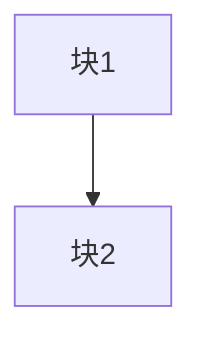
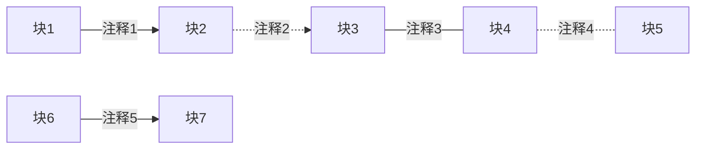

# mermaid 流程图入门教程

## 使用准备

在 vscode 中扩展界面搜索 meimaid，下载下图扩展，既可以直接编写 mermaid 文件，也可以在 markdown 文件中渲染 mermaid 流程图


下载后记得设置快捷键，把 preview 一项的快捷键改成不冲突的（双击键绑定就可以修改，修改后可能会消失，这是一个小bug，跟我一样搜索就可以重新找到）


mermaid 源文件的后缀名为 `.mmd`，可以独立编写，在 vscode 中新建文件并把后缀名正确设置即可开始编写，也可以在 markdown 文件中用 \`\`\`mermaid 带出文本框进行编写

## 简单流程图

### 1. 流程图方向

流程图的方向分为从左到右（LR，即 left-right）和从上到下（TD，即 top-down，也叫 TB，即 top-bottom），同理从右到左（RL）和从下到上（BT/DT），发起流程图的第一句我们就要定义流程图的总体走向，要用 `graph [方向]` 语法来规定，下例

- 横向LR流程图：
```text
graph LR
    A["块1"]
    B["块2"]
    
    A --> B
```


- 纵向TD/TB流程图：
```text
graph TD
    A["块1"]
    B["块2"]
    
    A --> B
```


### 2. 节点定义

在上例子中已经可以看到节点的定义方法，初始化的语法为 `变量名["节点内容"]`，并且根据选择括号的不同有着不同的节点形状，下例

```text
graph TB
    A["矩形"]
    B{"菱形"}
    C[("圆柱")]
    D(["椭圆"])
    E{{"六边形"}}
```


可以看到 `变量名` 只作为程序读取内容，不会被显示，而只有引号内的文字会被渲染显示

> tip：需要在单个格子内换行可以用 `</br>` 进行 html 注入

### 3. 边定义

应用所有已定义的节点，可以用一定方式将他们连接起来，就可以形成流程图，连接语法为 `节点变量名1 连线方式 节点变量名2`，连线方式有以下几种

```text
graph LR
    A["块1"]
    B["块2"]
    C["块3"]
    D["块4"]
    
    A --> B     # 实线
    B -.-> C    # 虚线
    C --- D     # 无箭头实线
    D -.- E     # 无箭头虚线
```


有时候我们需要在某些连线的边上进行文字注释，这时候我们可以在原来的基础上进行添加，添加方式为 `连线方式|注释内容|`，下例

```text
graph LR
    A["块1"]
    B["块2"]
    C["块3"]
    D["块4"]
    E["块5"]
    F["块6"]
    G["块7"]
    
    A -->|注释1| B
    B -.->|注释2| C
    C ---|注释3| D
    D -.-|注释4| E
    F -- 注释5 --> G    # 特殊情况，普通箭头可以简写
```
